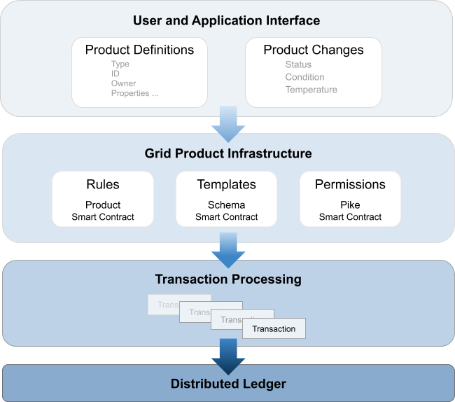

# Grid Product

<!--
  Copyright 2018-2020 Cargill Incorporated
  Licensed under Creative Commons Attribution 4.0 International License
  https://creativecommons.org/licenses/by/4.0/
-->

Grid Product provides a way to share standardized product data for items that
are transacted, traded, or referenced in a supply chain. Grid Product is
grounded in [GS1 standards](https://www.gs1.org/standards) for trade items, but
features a flexible design that can be extended to other standards.

With Grid Product, it's easy to define and share product-related data.

* Uniquely identify each trade item with standard identifiers such as [GTINs
  (Global Trade Item Numbers)](https://www.gs1.org/standards/id-keys/gtin).

* Specify product properties using standards such as the [GS1 Attribute
  Definitions for Business
  (ADB)](https://www.gs1.org/standards/attribute-definitions-for-business ).

Hyperledger Grid's modular architecture allows Grid Product to cleanly separate
the product-related business rules from the creation and management of product
data.  The Grid Product smart contract defines the product operations (create,
update, and delete). Other Grid utilities let users and applications define,
manage, and query trade item data with command-line tools, YAML files, and
web-based requests to REST API endpoints. As a result, product management is
easily handled without additional application development or smart contract
creation.

Grid Product can interact seamlessly with other smart contracts to manage owner
and agent permissions,  product property templates (also called schemas),
location data, and more.

These components combine to submit transactions to the back-end distributed
ledger, securely and efficiently sharing product data with all trading partners.
